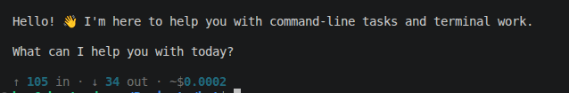
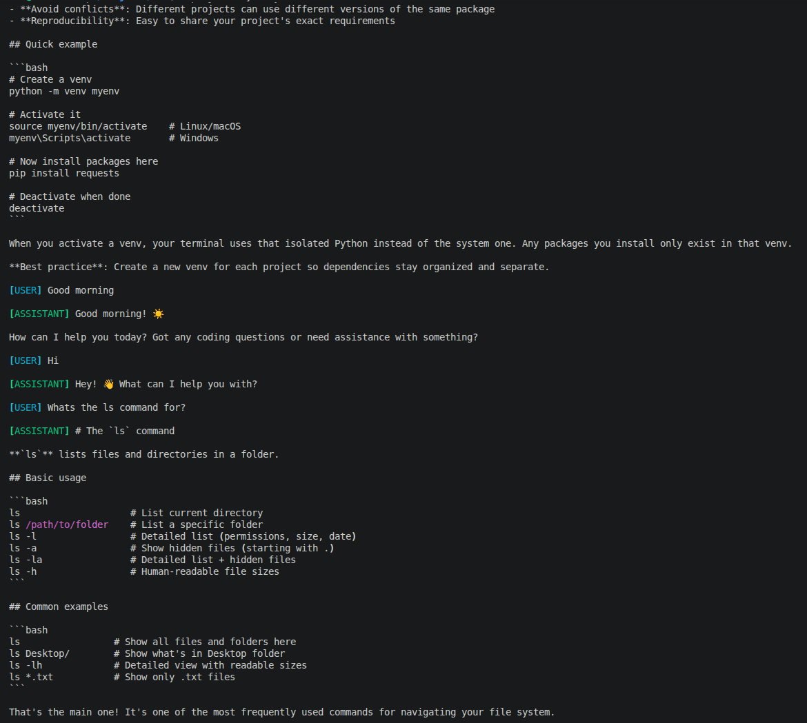
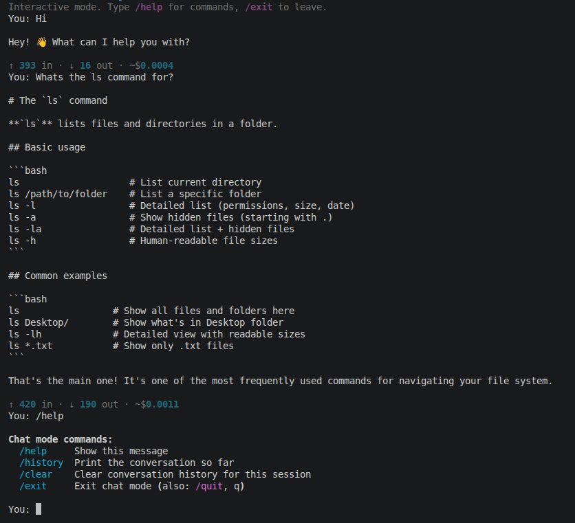
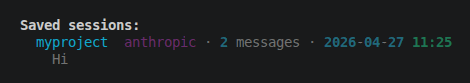
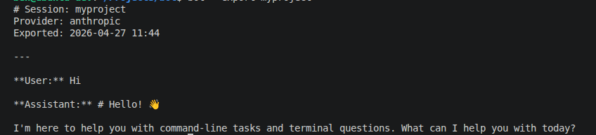
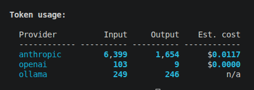
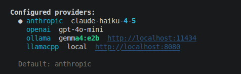

# inzen-bot

[](https://pepy.tech/projects/inzen-bot)
[](https://pypi.org/project/inzen-bot/)

[](https://www.gnu.org/licenses/gpl-3.0)
[](https://github.com/benwalkerai/bot/actions/workflows/ci.yml)

**A multi-provider AI chatbot for the terminal.** Chat with Claude, GPT-4, Ollama, or llama.cpp without leaving your shell — with persistent conversation history, named sessions, token cost tracking, and a full interactive REPL mode.



No browser. No switching apps. Just ask and keep working.

---

## Contents

- [Features](#features)
- [Install](#install)
- [Setup](#setup)
- [Usage](#usage)
- [Interactive Mode](#interactive-mode)
- [Named Sessions](#named-sessions)
- [Token Usage](#token-usage)
- [Providers](#providers)
- [Configuration](#configuration)
- [Security](#security)
- [Requirements](#requirements)
- [Contributing](#contributing)
- [Releasing to PyPI](#releasing-to-pypi)

---

## Features

- **Multi-provider** — Claude, GPT-4, Ollama, llama.cpp, Groq, and any OpenAI-compatible endpoint
- **Persistent history** — follow-up with `bot step 2?` and it knows exactly what you mean
- **Named sessions** — keep separate threads for different projects, all stored locally
- **Interactive REPL** — `bot --chat` for a persistent conversation without re-typing flags
- **Token & cost tracking** — per-message footer and a `bot --usage` summary table across all providers
- **Session export** — dump any session to markdown or plain text
- **Secure by default** — local data files are user-only (600/700), session names are validated against path traversal

---

## Install

```bash
pip install inzen-bot
```

Or with [uv](https://github.com/astral-sh/uv):

```bash
uv add inzen-bot
```

---

## Setup

### 1. Set your API key

inzen-bot reads your API keys from environment variables.

**Linux / macOS** — add to your `~/.bashrc` or `~/.zshrc`:

```bash
export ANTHROPIC_API_KEY="sk-ant-..."
export OPENAI_API_KEY="sk-..."        # optional
```

Then reload:

```bash
source ~/.bashrc
```

**Windows (PowerShell)** — set permanently:

```powershell
[System.Environment]::SetEnvironmentVariable("ANTHROPIC_API_KEY", "sk-ant-...", "User")
```

Restart your terminal after running this.

> For Ollama and llama.cpp no API key is needed — just make sure the local server is running before use.

### 2. Verify it works

```bash
bot hello
```

You should see a streamed response from Claude with a token usage footer. If you get an error, check your API key:

```bash
# Linux / macOS
echo $ANTHROPIC_API_KEY

# Windows PowerShell
echo $env:ANTHROPIC_API_KEY
```

---

## Usage

Ask anything — history is automatic so you can follow up naturally:

```bash
bot how do I format a drive in Ubuntu?
bot step 2?
bot step 3?
```



Common flags:

```bash
# Use a specific provider for one query
bot --provider openai explain RAID levels

# Switch default provider permanently
bot --set-provider ollama

# Switch model
bot --set-model claude-opus-4-5

# View conversation history
bot --history

# Clear history
bot --clear

# List all configured providers
bot --providers

# Override the system prompt for one query
bot --system "You are a Python expert" explain decorators
```

---

## Interactive Mode

Use `--chat` for a persistent REPL — no need to retype flags between messages.

```bash
# Start a persistent chat session
bot --chat

# Start with an opening message, then continue the conversation
bot --chat explain how systemd services work

# Use a named session in interactive mode
bot --session myproject --chat
```

Inside the chat session the following slash commands are available:

| Command    | Description                                 |
|------------|---------------------------------------------|
| `/help`    | Show available commands                     |
| `/history` | Print the conversation so far               |
| `/clear`   | Clear conversation history for this session |
| `/exit`    | Exit chat mode (also: `/quit`, `q`)         |



---

## Named Sessions

Named sessions let you maintain separate, persistent conversation threads — useful for keeping different projects or topics isolated.

```bash
# Start or continue a named session
bot --session myproject what is a venv

# Pick up where you left off
bot --session myproject how do I activate it

# List all saved sessions
bot --sessions

# Export a session to markdown
bot --export myproject

# Export to a file
bot --export myproject --output myproject.md

# Delete a session
bot --clear-session myproject
```

Sessions are stored as JSON files in `~/.bot/sessions/` and are independent of provider — you can switch providers mid-session.





---

## Token Usage

Every response includes a per-message token and cost footer. Run `bot --usage` to see cumulative totals across all providers:



```bash
# View cumulative usage across all providers
bot --usage
```

---

## Providers

| Provider    | Requires            | Notes                                           |
|-------------|---------------------|-------------------------------------------------|
| `anthropic` | `ANTHROPIC_API_KEY` | Default. Claude models.                         |
| `openai`    | `OPENAI_API_KEY`    | GPT models. Also works for Groq, Together, etc. |
| `ollama`    | Ollama running      | Local inference. Free to run.                   |
| `llamacpp`  | llama.cpp running   | Local inference via OpenAI-compatible server.   |



### Ollama quickstart

```bash
# Install from https://ollama.ai, then:
ollama pull llama3
ollama serve
bot --set-provider ollama
bot hello from the terminal
```

### llama.cpp quickstart

```bash
# Build llama.cpp from https://github.com/ggerganov/llama.cpp, then run the server:
./server -m your-model.gguf --port 8080
bot --set-provider llamacpp
bot what is quantisation
```

### Using Groq or other OpenAI-compatible APIs

Point the OpenAI provider at any compatible endpoint via `~/.bot/config.json`:

```json
{
  "providers": {
    "groq": {
      "model": "llama-3.3-70b-versatile",
      "api_key_env": "GROQ_API_KEY",
      "base_url": "https://api.groq.com/openai/v1"
    }
  }
}
```

---

## Configuration

Config and history live in `~/.bot/`, with user-only file permissions on Linux and macOS:

```
~/.bot/                           (chmod 700)
├── config.json                   (chmod 600) — provider settings and defaults
├── history_anthropic.json        (chmod 600) — conversation history per provider
├── history_openai.json           (chmod 600)
├── history_ollama.json           (chmod 600)
├── usage_anthropic.json          (chmod 600) — cumulative token/cost data
└── sessions/                     (chmod 700)
    └── myproject.json            (chmod 600)
```

History is capped at 50 message pairs per provider. You can edit `~/.bot/config.json` directly to customise models, add providers, or set custom base URLs.

---

## Security

- **File permissions** — `~/.bot/` and all data files are created with user-only permissions (`700`/`600`) on Linux and macOS so other users on the same machine cannot read your history, API keys, or session data.
- **Session name validation** — session names are validated against a strict allowlist (letters, numbers, `.`, `_`, `-`) to prevent path traversal attacks. Names like `../etc/passwd` are rejected at the CLI boundary.
- **API keys** — keys are never written to disk; they are read only from environment variables at runtime.

---

## Requirements

- Python 3.12+
- `anthropic` — Anthropic/Claude provider
- `openai` — OpenAI and llama.cpp providers
- `rich` — terminal rendering
- `click` — CLI framework

---

## Cross-platform

Works on Linux, macOS, and Windows. Config and history paths resolve correctly on all platforms via `Path.home()`. File permission hardening applies on Unix only; Windows uses its own ACL-based access controls.

---

## Built by

[Inzen](https://inzen.ai) — AI consulting and LLM application development.

---

## Contributing

```bash
git clone https://github.com/benwalkerai/bot
cd bot
uv sync --group dev
uv run pytest          # run tests
uv run ruff check .    # lint
```

CI runs automatically on every push and pull request via GitHub Actions — tests and ruff must pass before merging.

---

## Releasing to PyPI

1. **Update the changelog** from conventional commits:

   ```bash
   uv run git-cliff --output CHANGELOG.md
   git add CHANGELOG.md
   git commit -m "docs: update changelog"
   ```

2. **Bump the version** — updates `pyproject.toml`, creates a commit, and tags it automatically:

   ```bash
   # patch: 0.2.1 → 0.2.2  |  minor: 0.2.1 → 0.3.0  |  major: 0.2.1 → 1.0.0
   uv run bump-my-version bump patch
   ```

3. **Push the commit and tag** — the tag triggers the PyPI publish workflow:

   ```bash
   git push && git push --tags
   ```

The `publish.yml` GitHub Actions workflow runs the tests, builds the package, and publishes to PyPI automatically via the `PYPI_API_TOKEN` secret.

---

## License

GPL-3.0
